# Quiz 4 Collaboration (Aplikasi Evaluasi Harian HSI dengan Menggunakan Django dan database MySQL berbasis CMD)

## **Project Summary**
This application uses a client server system built with the Django framework, user as an admin can manage the data that will be used as quiz material or data from the responses of participants.  
  
---

## **Who can access this app?**
- Admin 
  - Only admin can access the web admin and CMD app
- Participant 
  - Only participant can access the CMD app
---


## **CMD App**    

## 1. Login screen
  User will be asked to enter their ID and Password
- User is an **Admin**: 
  - a message will appear so that admin can access the web admin.
- 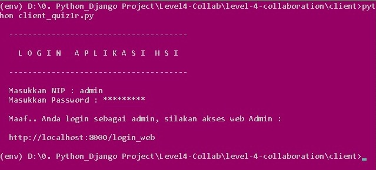    
  
- User is a **Participant**: 
  - If the NIP and Password are correct, participant will be confirmed to work on the evaluation question, and if the nip or password is entered incorrectly, a message will appear and also an opportunity to repeat the nip/password.    
- 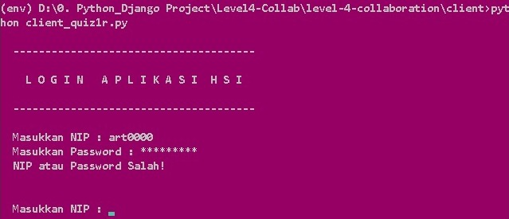   
  
## 2. Menu screen
  - Users can choose the menu provided by the application.
- 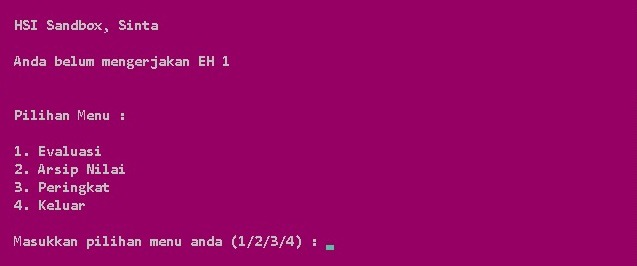

## 3. Running quiz
  - Participants will be asked to enter 'y' to continue the quiz, or 'n' to return
  each daily evaluation will give 2 questions randomly from the question bank
  - The evaluation questions will immediately be checked whether they are true or false, if **True** they will get **2 score**, and if **Wrong** they get a **1 score**
  - The evaluation value will be displayed after the participant completes the evaluation.   
- 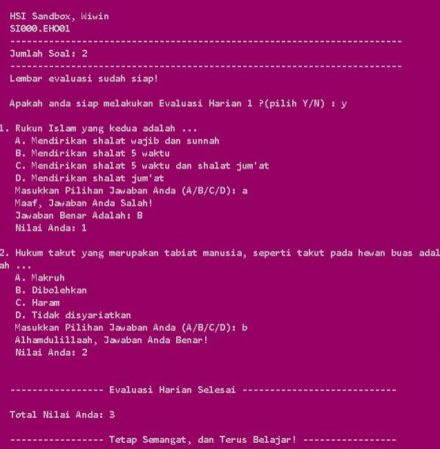   

## 4. Evaluation result
  - Participants can see their evaluation result.
- 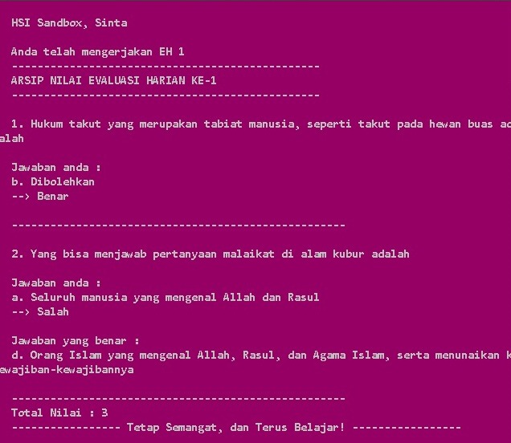

## 5. Rangking
  - Participants can see their evaluation result.
- 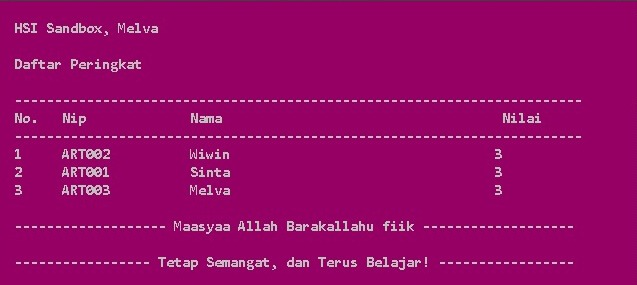

## 6. Daily evaluation done
  - Your evaluation is complete! please get ready to do the next evaluation.
- 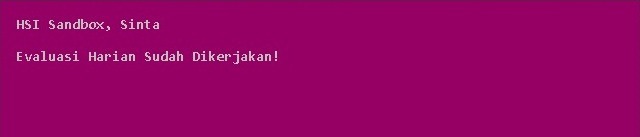

---

## **Admin Web**
## 1. Login
  - They will not be able to access this website unless they are **admin**.
- 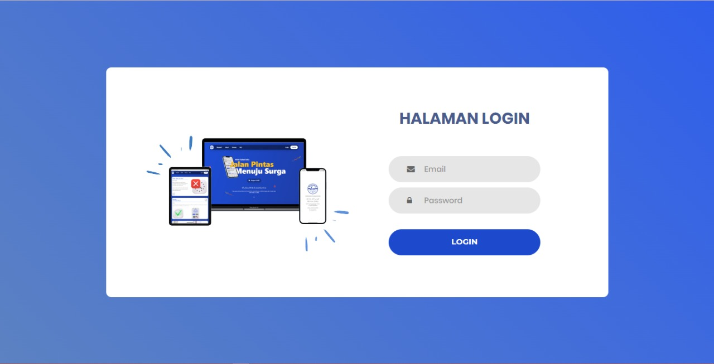

## 2. Dashboard
  - Some info will be displayed here to make it easier for admins to manage all data.
- 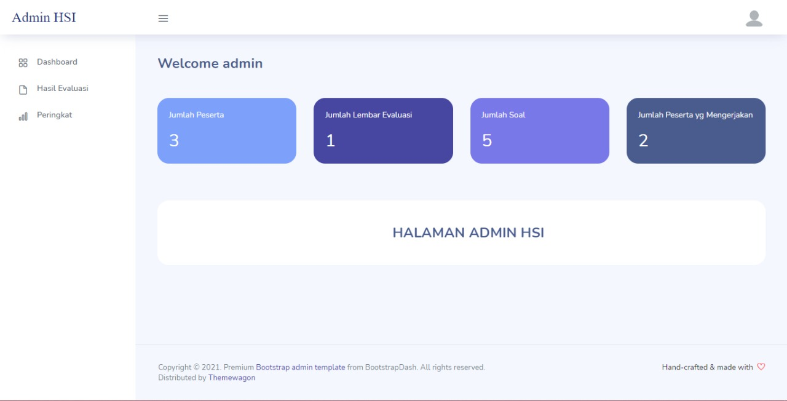

## 3. Participant evaluation
  - The evaluation page will display an evaluation based on time. Here the admin can see who has worked earlier and who is slower.
- 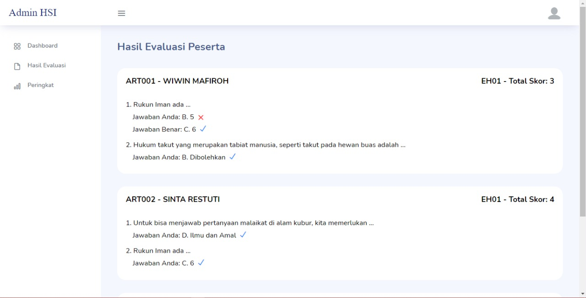
## 4. Participant rating
  - Admin has a record of participants answers sorted by their scores
- 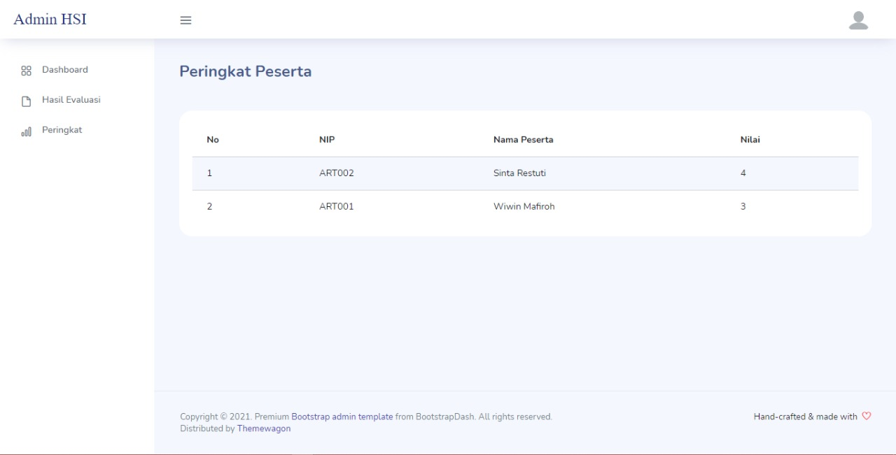
---

## **How the App works**
  
To run this project, first, you should start by having Python installed on your computer. It's advised you create a env to store your project dependencies separately. You can install env with the following command:  
  ```python
    python -m venv env
  ```
if you have multiple versions of python, you can specify them by calling the version
  ```python
    python`version` -m venv env
  ```

then you can activate the env with
  
  ```python
    Linux = source env/bin/activate
    Windows = source env/Scripts/activate
  ```
You need pip to install Python packages, this package will manage and help this project to run. You can install pip with the following command:
  
  ```python
    pip install -r requirements.py
  ```

Or you can install per package. Make sure you are in the right directory, :

- Client :
  - `pwinput`                      
  - `requests`

- Server :
  - `django`
  - `mysqlclient`
  - `wheel (for python version <= 3.7)`

how to install :
```python
  pip install -package name
```
Before accessing a web or cmd application, always make sure the port is running with runserver
  ```python
    python manage.py runserver
  ```
To access the web you can open it on port 8000, click here and do control-c to close the web
  ```python
    Starting development server at http://127.0.0.1:8000/
  ```
To access the cmd app, make sure you are in the client directory, then open it with
  ```python
    python client_quiz1r.py
  ```

---

**Our Team Members:**
- Leader : Wiwin Mafiroh
- Sinta
- Melva
- Novi
- Aqilah